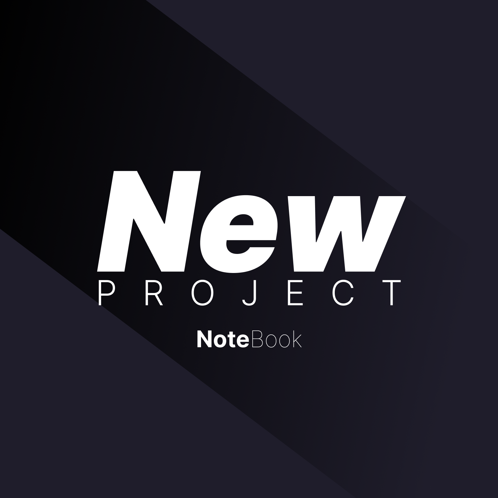
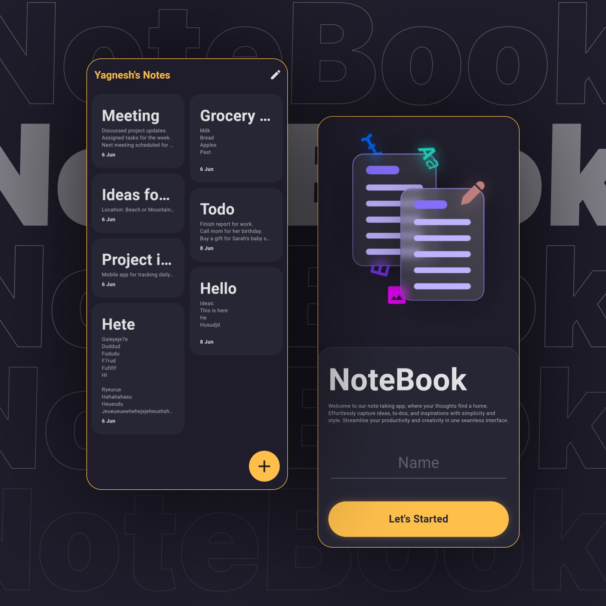

---

# 📒 Notebook Application

A Flutter application for creating and managing notes with a beautiful user interface.

## ScreenShot




## ✨ Features

- **Create Notes:** Easily create new notes with rich text formatting using flutter_quill.
- **Save Locally:** Notes are saved locally on the device using shared_preferences and sqflite.
- **CRUD Operations:** Implement CRUD (Create, Read, Update, Delete) operations for managing notes.
- **Beautiful UI:** Designed with a clean and intuitive user interface for a seamless note-taking experience.

## 📚 Libraries Used

- [GetX](https://pub.dev/packages/get): State management library for Flutter.
- [flutter_quill](https://pub.dev/packages/flutter_quill): Rich text editing library for Flutter.
- [shared_preferences](https://pub.dev/packages/shared_preferences): Plugin for persistently storing simple data on the device.
- [sqflite](https://pub.dev/packages/sqflite): SQLite plugin for Flutter, used for storing structured data on the device.

## 🚀 Getting Started

To run this application locally, you need to have Flutter installed on your machine. If you haven't already, you can follow the [official Flutter installation guide](https://flutter.dev/docs/get-started/install) to get set up.

```bash
# Clone the repository
git clone https://github.com/yagnesh0312/notebook.git

# Navigate to the project directory
cd notebook

# Get dependencies
flutter pub get

# Run the app
flutter run
```
